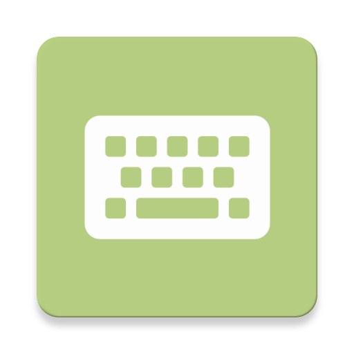

  

## NumberKeyboardView

>通过RecyclerView打造一个简单的数字键盘 ⌨️

### 演示

### 开发日志

可在博客中查看文章，[自定义View之数字键盘 (NumberKeyboardView)](https://plain-dev.com/number-keyboard-view/)

### 其它

1. 感谢🙏项目[WeChatPswKeyboard](https://github.com/zuiwuyuan/WeChatPswKeyboard)，本项目是由此修改而来

2. 有问题欢迎提交`issues`

3. 状态图标来源[iconfont](https://www.iconfont.cn/)，侵删